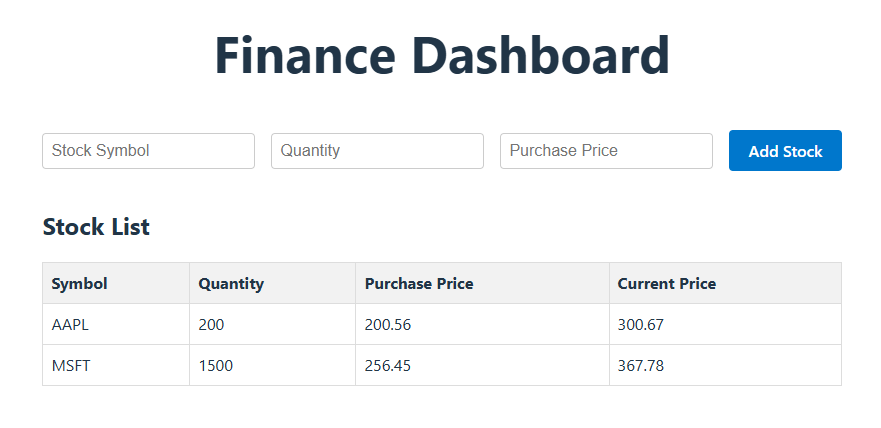
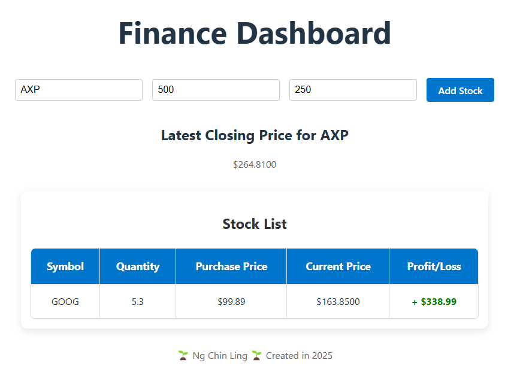
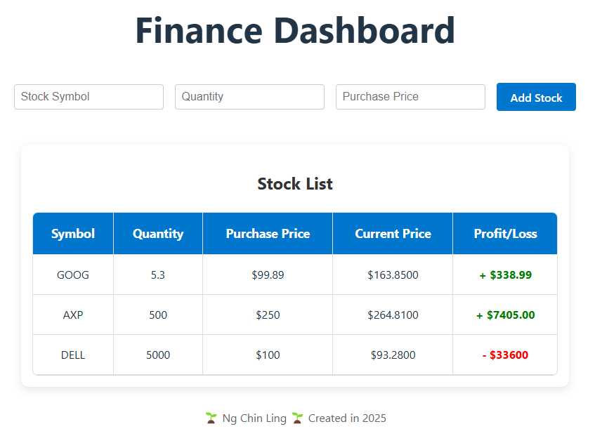
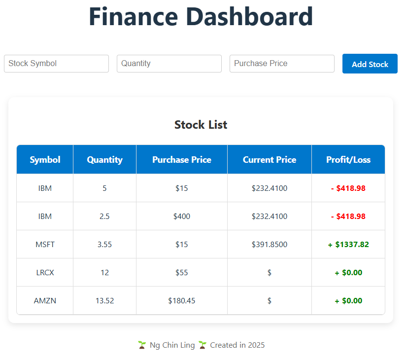

# Heicoders Academy SE100 Capstone Project - Finance Dashboard
The Finance Project is built using React, Vite (and Express). The dashboard will allow users to enter multiple stock purchases and display the current value and profit/ loss for each stock. The prices are retrieved at the server (ngchinling-capstone-server) using API calls to AlphaVantage's API.

## Form and CSS styling
<!--  -->

## API calls

## Table of stock value results

